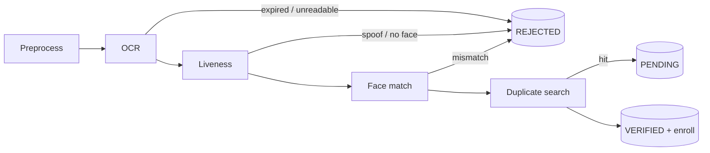
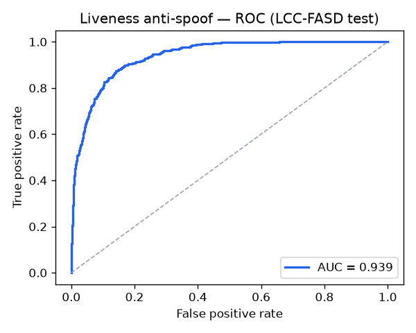
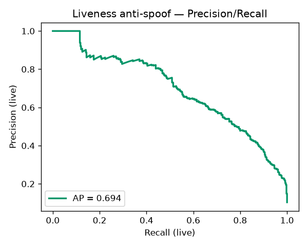
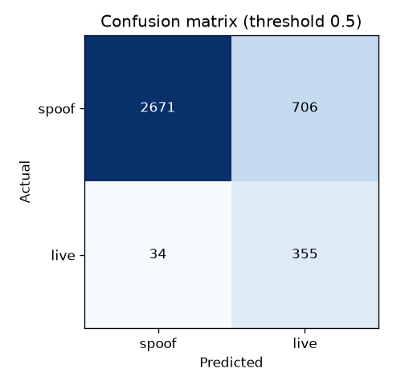
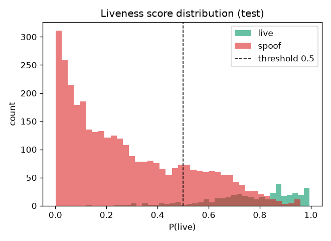
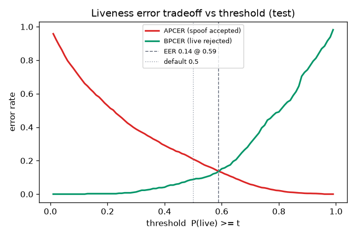
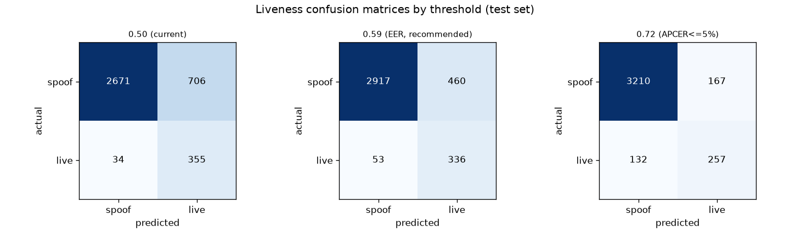

# KYC-API — ML Verification Pipeline

Engineering report for the machine-learning verification pipeline
(Design doc §6.3.1). Covers what was built for every module, the design
alternatives weighed and why, the problems hit and how they were solved
(including approaches that were tried and then replaced), and the liveness
training results.

The pipeline turns an ID document + a live selfie into a KYC verdict —
`VERIFIED`, `PENDING` (manual review), or `REJECTED` — through six stages.

Each stage exits early: an expensive stage (ArcFace, FAISS) never runs
after a cheaper one has already decided the outcome.

---

## 1. Foundations (built before the stages)

Laid down so the stages and their tests could be developed independently of
the heavy ML stack.

- **Contracts** (`app/pipeline/contracts.py`) — frozen dataclasses with **no
  ML imports** (`PipelineInput`, `OcrResult`, `LivenessOutcome`,
  `FaceMatchOutcome`, `DuplicateOutcome`, `Decision`, `RejectReason`). This
  lets the orchestrator, decision engine, and API run and be tested without
  installing OpenCV/DeepFace/FAISS.
- **Decision engine** (`app/pipeline/decision.py`) — `decide(...)` applies
  the §6.3.3 priority order (liveness → face → duplicate) and is tolerant of
  `None` for stages skipped by early-exit, so it stays the single source of
  the verdict.
- **Orchestrator stub** — Phase-2 canned `VERIFIED`, later replaced by the
  real composition (§7) without changing the API's shape.
- **Conventions** — `ruff` (79-col, Google docstrings), lazy ML imports in
  every stage module so import stays light.

**Contract evolution during the work:** added `OcrResult.occupation` (an
MFI underwriting signal); renamed `id_image → id_front_image` and added an
optional `id_back_image`; introduced a `DocumentType` (`NIC`/`PASSPORT`)
discriminator. A frozen dataclass can't express "a NIC requires a back
image," so that rule lives at the API layer (`build_pipeline_input`). Also
migrated the enums to `enum.StrEnum` (clearing a `ruff UP042` debt).

---

## 2. Preprocessing

`app/pipeline/stages/preprocess.py`

**Built:** `preprocess_image` (decode → downscale to ≤1280px → CLAHE
lighting normalization on the LAB L-channel → deskew via the minimum-area
rectangle angle) and `crop_nic_zones` (splits the ID front into a
`text_zone` and a `photo_zone`).

**Alternatives / improvisation:**
- The first version was only *decode + downscale*. Checking the design doc's
  Image-Preprocessor spec showed lighting normalization, deskew, and zone
  cropping were also required — these were added.
- For `crop_nic_zones` the obvious approach was a **fixed-ratio crop**, but
  the three reference layouts have the photo in different places (NIC v1
  photo **right**, NIC v2 photo **top**, passport photo **left**). A single
  ratio cannot work. **Chosen approach:** locate the printed portrait with an
  OpenCV **Haar cascade** (bundled, no model download), make its padded box
  the `photo_zone`, and take the largest region beside it as the `text_zone`.
  This is layout-agnostic and handled all three documents.

**Problem → solution:** a global (Otsu-style) contrast approach and naive
resize left text on the guilloche background hard to read; CLAHE on
luminance only (not colour) rescued shadowed text without shifting card
colours.

---

## 3. OCR

`app/pipeline/stages/ocr.py`

**Built:** `ocr_extract` dispatches on `document_type`. Extraction combines
(a) **bilingual FR/EN label parsing** of the visual fields (Tesseract) and
(b) **MRZ decoding via PassportEye** (`read_mrz_fields`), which does its own
detection, rotation, and ICAO 9303 check-digit parsing on the **raw** image
(NIC back / passport front). Front and back results are merged by a
confidence rank so a check-valid MRZ field (0.98) overrides the same field
read from the printed text (0.75). `success` requires name + id + expiry.

**Alternatives weighed** (a decision was taken with the user):
1. **MRZ-first + region crops** *(chosen)* — trust the checksummed MRZ where
   present; visual parsing as the fallback.
2. `image_to_data` geometry — per-word boxes to associate values to labels.
3. Defer OCR entirely.

**Problems and the sequence of solutions:**
- *Naive label parsing was too fragile on real OCR output* (values on a
  separate line with garbage prefixes, two-column back layouts) → moved to
  **MRZ-first**.
- *OCR of the raw card was mush.* First tried a global Otsu threshold (worse)
  → replaced with **upscale + denoise + adaptive threshold** for visual text,
  and a dedicated Otsu + OCR-B-charset pass for the MRZ.
- *MRZ localization:* OCRing the whole card polluted the MRZ read → added
  `_locate_mrz` (blackhat → gradient → morphological close → widest
  full-width band).
- *Bugs found and fixed:* the MRZ check digit was being computed over the
  *stringified value* instead of the raw fixed-width field; bilingual labels
  left the English half stuck in the value; MRZ lines fail an exact-length
  test because OCR trims trailing `<` fillers → switched to **detect by line
  count + pad to width**.
- **Key data problem:** the sample documents in `docs/Identifiers/` are
  **design mockups** — their MRZs are non-functional placeholders and some
  dates are impossible (month `00`, year `9999`). OCR therefore **cannot be
  validated end-to-end on them**. Resolution: **verify synthetically**
  (render a valid MRZ, confirm localize → OCR → check-digit decode) and defer
  real-card tuning to staging.
- **NIC v1 visual extraction is deferred** — it has no MRZ, so it depends on
  the fragile visual path; hand-tuning crop coordinates to a single fake
  mockup would overfit. It routes to manual review until real cards exist.

**Audit fix #1:** passports were being fed only the cropped `text_zone`,
truncating the full-width bottom MRZ → the orchestrator now OCRs the **full
front page** for passports (NIC keeps the text-zone crop).

**Real-card rework (`feat/ocr-improvements`):** the first real Cameroon NIC
run rejected with `OCR_FAILED` on visibly clean images. `scripts/ocr_debug.py`
(new diagnostic dumping every intermediate) located two root causes, both now
fixed:
- *Adaptive threshold shredded the card.* The guilloche/emblem background was
  binarized into noise, so Tesseract returned garbage. → Dropped denoise +
  adaptive threshold; feed **upscaled grayscale** and let Tesseract binarize
  internally. Visual text is now legible.
- *The hand-rolled MRZ path failed on the real card.* The NIC v2 MRZ runs
  **vertically** at low contrast; `_locate_mrz` never found it. → Replaced the
  entire hand-rolled MRZ stack (`_locate_mrz`, `_parse_td1/td3`, check-digit
  code) with **PassportEye**, which detects + rotates + check-digit-parses the
  raw image. It must see the **raw bytes** — feeding our preprocessed array
  dropped `valid_score` from 100 to 2 — so the orchestrator threads
  `mrz_bytes` (raw `id_back_image`/`id_front_image`) straight through.
- *Result:* the real NIC now extracts name, CNI number (from MRZ `optional1`),
  DOB, expiry, and sex — all checksummed — and passes (`success=True`). Dep
  added: `passporteye>=2.2` (lightweight, no torch).
- *Visual fields fixed by parsing, not a heavier engine.* `place_of_birth`
  and `occupation` (absent from the MRZ) came out as garbage — but the
  diagnostic showed Tesseract *did* read `LIMBE`/`ETUDIANT`; they sit on the
  line **below** the label, while the label line trails into mixed-case
  guilloche speckle (`joa id hn See`). `_value_after` was taking any non-empty
  same-line remainder. Fix: an `_upper_value` extractor (first run of ALL-CAPS
  words, ≥3 chars) applied to the alphabetic fields (name, place, occupation);
  the speckle yields nothing so the parser falls through to the real value.
  id/date/sex keep the generic cleaner. Real card now reads `LIMBE` /
  `ETUDIANT`.
- *Still open:* the printed name's **hyphen** (`Luc-Xavier`) is lost — ICAO
  9303 encodes hyphens/apostrophes as the `<` filler, indistinguishable from a
  name-part separator, so the MRZ can't carry it. Recovering it needs a clean
  visual read of the front name (currently too garbled) to restore punctuation
  by aligning to the MRZ tokens. NIC v1 (no MRZ) still routes to review.
  EasyOCR remains the eventual lever for the front-name/v1 visual path once
  torch can be installed on the VM.

The `docs/Identifiers/` mockup caveat above stands for the sample images, but
the pipeline is now **validated against a real card** end-to-end.

---

## 4. Liveness (anti-spoofing)

`app/pipeline/stages/liveness.py`, trainer `ml/train_antispoof.py`

Two layers: **MediaPipe BlazeFace** confirms a real face is present, then an
**LBP-texture SVM** scores the selfie for print/replay spoofing (§6.3.2).

**Built:**
- `extract_lbp_features` — 8-neighbour LBP over a 128px face, 16px cells,
  256-bin histograms, L2-normalized → a **16 384-d** vector. The *same*
  extractor is used at training and inference to keep them in lock-step.
- Model pipeline: **StandardScaler → PCA(128) → RBF-SVM**, hyperparameters
  chosen by **k-fold cross-validation** (`GridSearchCV`), then wrapped once in
  `CalibratedClassifierCV` for probabilities.

**Dataset — LCC-FASD.** Ships as a flat image folder plus four protocol
files that define the official **subject-independent** split
(`CLIENT_*` = live, `IMPOSTER_*` = spoof). `ml/prepare_lcc_fasd.py` links
them into `data/antispoof/{train,test}/{live,spoof}`. Classes are imbalanced
~1:8.7 (handled with `class_weight="balanced"`).

**Problems and the sequence of solutions:**
- *MediaPipe:* this build (0.10.35) ships **only the Tasks API** — the legacy
  `mp.solutions` does not exist. Switched to the Tasks `FaceDetector`
  (BlazeFace) and fetched its `.tflite` asset.
- *Training was infeasible:* `SVC(probability=True)` on 16 384-d features ran
  for **~65 CPU-minutes with no result** (and is deprecated in sklearn 1.9).
  **Solution:** add **PCA(128)** ahead of the SVM (kernel becomes tiny),
  grid-search a plain SVM, and calibrate **once** with
  `CalibratedClassifierCV`. Training then finished in ~2 minutes.
- *Validation methodology:* k-fold CV **inside** the training set is the
  validation signal (no separate validation folder); the test set is scored
  **once** for an unbiased number.

### 4.1 Training results

Balanced 800/class train subsample, evaluated on the **full LCC-FASD test
split** (389 live, 3 377 spoof). Best CV config: `C=10, gamma=scale, rbf`;
cross-validated ROC-AUC ≈ 0.86.

| Metric (test) | Value |
|---|---|
| **ROC-AUC** | **0.939** |
| Average precision | 0.694 |
| Accuracy @ 0.5 | 0.804 |
| Recall (live) @ 0.5 | 0.913 |
| Precision (live) @ 0.5 | 0.335 |
| F1 (live) @ 0.5 | 0.490 |

**Reading the results:** ROC-AUC 0.939 shows the model **separates live from
spoof well**. But at the default **0.5** threshold, recall is high (0.91)
while precision is low (0.33) — with 8.7× more spoofs than live, a permissive
cut lets many spoofs score above 0.5. The score-distribution and PR plots
make this visible. **Implication:** the operating **threshold must be tuned**
(raise it to trade recall for precision — for KYC, *not accepting a spoof*
usually matters more than *not rejecting a real user*).

### 4.2 Choosing the operating threshold

The 0.5 default was a placeholder, **not** derived from data. Studied on the
test set, the security/UX tradeoff — APCER (spoof accepted as live) vs BPCER
(genuine user rejected) — is:

| operating point | threshold | APCER (spoof accepted) | BPCER (live rejected) |
|---|---|---|---|
| default 0.5 (guessed) | 0.500 | **20.9%** | 8.7% |
| Youden's J (max separation) | 0.582 | 14.2% | 12.6% |
| Equal Error Rate (EER) | 0.589 | 13.7% | 13.6% |
| APCER ≤ 10% | 0.645 | 9.7% | 20.1% |
| APCER ≤ 5% | 0.719 | 4.9% | 33.9% |
| APCER ≤ 2% | 0.805 | 1.9% | 49.1% |
| APCER ≤ 1% | 0.856 | 0.9% | 59.6% |

- **0.5 is too permissive** — it accepts ~21% of spoof attempts.
- **EER ≈ 0.59** balances both errors at ~14% — a better neutral default.
- **Security-first (KYC):** accepting a spoof is usually worse than rejecting
  a genuine user, so lean higher. APCER ≤ 5% needs threshold ~0.72, but that
  rejects ~34% of genuine users — who must be handled by a retry / manual
  review path, not a hard fail.
- **No free lunch:** the model's discrimination (AUC 0.94) fixes this curve.
  Driving APCER below ~5% costs heavy BPCER; a materially better operating
  point needs a **stronger model** (more data, the face-crop retrain #2, or a
  deeper anti-spoof network), not just a threshold move.
- **Caveat:** these rates are on LCC-FASD (webcam captures) — a proxy. The
  threshold must be re-tuned on production-like selfies.

**Implemented policy (security-first + review band):**

| P(live) | Verdict | Rationale |
|---|---|---|
| **≥ 0.72** | pass (continue) | ≈5% attack-accept on the test set |
| **0.30 – 0.72** | **PENDING** (`LIVENESS_REVIEW`) | uncertain — a human reviews it |
| **< 0.30** | REJECTED (`LIVENESS_FAILED`) | clear spoof |

This *minimizes spoofs entering the system* (nothing below 0.72 is
auto-passed) while sending only the **uncertain middle** to manual review
rather than hard-rejecting every borderline genuine user. On the test set,
0.5 → 0.72 cuts auto-accepted spoofs from **706 to 167** (−76%). Constants:
`LIVENESS_THRESHOLD = 0.72` (liveness stage), `LIVENESS_REVIEW_THRESHOLD =
0.30` (decision engine). These are LCC-FASD (proxy) values — **re-tune on
real selfies before production.**

**Deferred (audit #2):** the LBP currently runs on the whole selfie, not the
cropped face. Train and serve are consistent (both whole-image), and LCC-FASD
images are already face-centred, so this is a **robustness** item — best
validated with real production selfies in staging (now cheap, since
`face_detect.crop_face` exists).

---

## 5. Face matching

`app/pipeline/stages/face_match.py`

**Built:** `represent_face` embeds a face into a **512-d ArcFace** vector
(DeepFace); `match_faces` scores the cosine similarity of the selfie vs the
NIC `photo_zone` against a tunable threshold (default **0.40**). The same
`represent_face` embedding is reused by the duplicate stage.

**Problems / solutions:**
- *ArcFace weights (~137 MB) download slowly* — fetched once to
  `~/.deepface/weights/` (outside the repo; must be provisioned in
  deployment, like the BlazeFace asset).
- **Audit fix #3 — detector inconsistency.** Liveness used BlazeFace but the
  embedder used a different (opencv Haar) detector with
  `enforce_detection=False`, which could silently embed the *whole frame* when
  Haar missed a face → false mismatches. **Solution:** a shared
  `app/pipeline/face_detect.py` (one BlazeFace detector; `detect_face_box`,
  `face_present`, `crop_face`). `represent_face` now **crops the face with
  BlazeFace first**, then ArcFace aligns within that crop — its worst-case
  fallback is a real face crop, never the whole frame.

**Validation** on the reference portraits (same person vs different person):

| Variant | same-person | different-person |
|---|---|---|
| opencv on whole image (before) | 0.574 | 0.119 |
| **BlazeFace crop + opencv align (after)** | **0.601** | **0.127** |

The threshold 0.40 sits cleanly in the gap; the shared-detector version
improves separation.

---

## 6. Duplicate detection

`app/pipeline/stages/duplicate.py`

**Built:** `FaceIndex` wraps a **FAISS `IndexFlatIP`** over L2-normalized
embeddings, so inner product = cosine similarity. `search` returns a
`DuplicateOutcome` when the nearest enrolled face clears the threshold
(default **0.60**). The index is built **per-MFI** and **excludes the
querying client** so a client never matches itself.

**Design note:** the persistent store is the pgvector `FaceEmbedding` table;
FAISS is the in-memory search accelerator built from it at request time.

---

## 7. Orchestration

`app/pipeline/orchestrator.py`

**Built:** `run_verification` composes preprocess → OCR → liveness → face →
duplicate → `decide`, with **early exit** (OCR/expiry rejects inline; a
failed liveness or face check skips the remaining expensive stages). The
selfie is embedded **once** and reused for both the match and the duplicate
search.

**Design decision — pure pipeline (Option A).** `FaceEmbedding` needs a
`verification_id`, but the pipeline enrols *before* the endpoint has created
the verification row (chicken-and-egg). Rather than a two-phase
create-then-update, `run_verification` returns
`VerificationOutput(result, embedding)` and does **no DB writes**; the
endpoint persists everything in one transaction. The `DuplicateStore` port
is therefore **read-only**, keeping the pipeline side-effect free.

**Validated end-to-end** (real images, OCR stubbed to isolate the ML path):
run 1 → `VERIFIED` (enrols), run 2 with the **same face under a different
client** → `PENDING` (duplicate caught across clients).

---

## 8. API / DB integration

`app/api/v1/routes/verify.py`, `app/services/duplicate_store.py`

**Built:**
- `/kyc/verify` accepts **multipart uploads** (`id_front`, `selfie`, optional
  `id_back`) + `client_id`/`document_type`. `build_pipeline_input` validates
  (front + selfie required; NIC requires a back).
- `PgVectorDuplicateStore` implements the read-only port over `FaceEmbedding`
  (scoped per MFI, excluding the querying client).
- The endpoint persists `Verification` + (on a clean pass) `FaceEmbedding`
  and consumes one unit of quota in a single transaction.

**Problem / solution:** the project Postgres wasn't running, so integration
tests couldn't execute. Brought up the pgvector/pg16 container
(`docker/docker-compose.yml`) and ran the Alembic migrations; the full suite
then executed against a live database.

A real end-to-end HTTP request through the **unmocked** pipeline returns
`201 REJECTED / OCR_FAILED` on the placeholder images (expected — they aren't
OCR-readable) with the verification persisted, confirming the whole chain.

---

## 9. Audit (code-review) outcomes

A high-effort review of the merged pipeline produced four findings:

| # | Finding | Resolution |
|---|---|---|
| 1 | Passport OCR truncated the full-width MRZ (cropped text zone) | **Fixed** — OCR the full front page for passports |
| 2 | LBP runs on the whole selfie, not the face crop | **Deferred** — robustness item, needs real selfies (crop util now exists) |
| 3 | Face embedding used a different detector than liveness (whole-frame fallback) | **Fixed** — shared BlazeFace `face_detect`; crop before ArcFace |
| 4 | A faceless ID raises 400 rather than a REJECTED record | **Kept 400** — malformed input, by decision |

---

## 10. Known limitations & staging TODOs

- **NIC v1 visual OCR** — deferred; needs real cards to calibrate (mockups
  are unusable). Route low-confidence extractions to manual review.
- **Liveness threshold** — the 0.5 default is too permissive on the imbalanced
  set; tune on an ROC operating point (ideally with real selfies).
- **Liveness LBP on face crop (#2)** — retrain on face crops; validate against
  real selfies.
- **Model assets** are provisioned outside git and must be present at deploy:
  - `ml/models/antispoof_lbp_svm.joblib` — `python ml/train_antispoof.py …`
  - `ml/models/blaze_face_short_range.tflite` — MediaPipe BlazeFace
  - `~/.deepface/weights/arcface_weights.h5` — ArcFace

---

## 11. Test coverage

**107 tests** (unit + integration), green against a live Postgres:

- Deterministic unit tests for every stage's pure logic (LBP maths, MRZ
  check digits/decode, date parsing, cosine similarity, FAISS search,
  orchestrator early-exit).
- Synthetic end-to-end verification where real data is unavailable (rendered
  MRZ; toy anti-spoof dataset proving the trainer learns).
- Integration tests (real DB + pgvector) for the multipart endpoint,
  persistence, quota, and the duplicate store.

*Assets for this report:* `docs/ml-pipeline-assets/` (ROC, PR, confusion
matrix, score distribution, and `liveness_metrics.json`).
